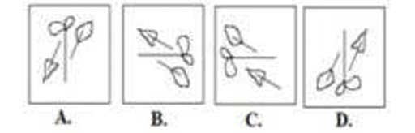

# Online Examination System

The **Online Examination System** is a web-based application designed to conduct timed exams with a user-friendly interface. It supports **100 multiple-choice questions**, a **90-minute timer**, **question navigation**, **marking for review**, and **result display**. The system includes **image-based questions** stored in a JSON file for dynamic loading.

Developed by **[Mahesh-more1](https://github.com/Mahesh-more1)**.

---

## 🌟 Features

- **Start Screen**: Displays exam instructions and a "Start Exam" button.
- **Question Navigation**: Sidebar with buttons to jump to any question.
- **Timer**: 90-minute countdown, auto-submits when time runs out.
- **Mark for Review**: Flag questions for later review.
- **Results Modal**: Shows:
  - Total Questions
  - Correct/Incorrect Answers
  - Unanswered Questions
  - Final Score
- **Image Support**: Includes visual questions (e.g., `q40.png` to `q60.png`).
- **Responsive Design**: Mobile and desktop friendly.
- **Keyboard Navigation**:
  - `→` / `←` for next/previous
  - `M` to mark for review

---

## ✅ Prerequisites

Ensure you have:

- A modern web browser (Chrome, Firefox, Edge)
- A text editor like **VS Code**
- **Git** installed for version control
- A **GitHub** account (if contributing)

---

## 🚀 Installation

1. **Clone the Repository**
   ```bash
   git clone https://github.com/Mahesh-more1/online-examination-system.git
   ```
````

2. **Navigate to the Project Directory**

   ```bash
   cd online-examination-system
   ```

3. **Open the Project**

   - Double-click `index.html` to run in a browser.
   - OR use **Live Server extension** in VS Code for image loading.

---

## 🧪 Usage

### ▶️ Start the Exam

- Open `index.html` in browser
- Read instructions → Click **Start Exam**

### 🔁 Navigate Questions

- Use `Next` / `Previous` or arrow keys
- Click question number buttons to jump directly
- Press **M** to mark for review

### 📤 Submit the Exam

- Click **Submit Exam** or wait for timer
- View results in the modal

#### Example:

> "What is 2 + 2?"
> Options: \[1], \[2], \[3], \[4]

Or image-based:

> 

---

## 📁 Project Structure

```
online-examination-system/
├── index.html        # Main interface
├── style.css         # Styling and layout
├── script.js         # Core logic, navigation, timer
├── check.js          # 100-question dataset (array format)
├── questions.json    # For dynamic question loading (optional)
├── img/              # Image-based questions (q40.png–q60.png)
└── README.md         # Project documentation
```

---

## 🤝 Contributing

We welcome contributions!

1. **Fork** the repo
2. Create a branch:

   ```bash
   git checkout -b feature/your-feature
   ```

3. Commit changes:

   ```bash
   git commit -m "Add your feature"
   ```

4. Push branch:

   ```bash
   git push origin feature/your-feature
   ```

5. Create a **Pull Request**

> Please read `CONTRIBUTING.md` for guidelines.

---

## 📄 License

This project is licensed under the **MIT License**.
See `LICENSE.md` for more info.

---

## 🙏 Acknowledgments

- Inspired by **Quizizz** and **Google Forms**
- Built using **HTML**, **CSS**, and **JavaScript**
- Thanks to the open-source community ❤️

---

## 📬 Contact

- **Author**: Mahesh More
- **GitHub**: [Mahesh-more1](https://github.com/Mahesh-more1)
- **Email**: [mmore2743@gmail.com](mailto:mmore2743@gmail.com)
- **LinkedIn**: _(www.linkedin.com/in/mahesh-more-616565355)_

---

## 🗓️ Last Updated

**Date**: July 13, 2025, 12:09 AM IST

```

Let me know if you'd like the Markdown rendered into PDF or customized further (e.g., add screenshots, setup GIFs, or deployment instructions).
```
