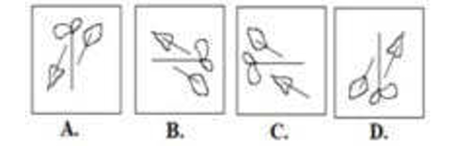

<!-- PROJECT SHIELDS -->
<div align="center">

  <a href="https://github.com/Mahesh-more1/online-examination-system/graphs/contributors">
    
  </a>
  <a href="https://github.com/Mahesh-more1/online-examination-system/network/members">
    
  </a>
  <a href="https://github.com/Mahesh-more1/online-examination-system/stargazers">
    
  </a>
  <a href="https://github.com/Mahesh-more1/online-examination-system/issues">
    
  </a>
  <a href="https://github.com/Mahesh-more1/online-examination-system/blob/main/LICENSE">
    
  </a>

</div>

<!-- PROJECT LOGO -->
<br />
<div align="center">
  <h2 align="center"><strong>🧪 Online Examination System</strong></h2>

  <p align="center">
    A web-based platform to conduct timed multiple-choice exams with navigation, review, and scoring features.<br />
    <em>"Simple, Fast, and Reliable Online Testing."</em>
  </p>

  <p align="center">
    <a href="https://mahesh-more1.github.io/online-examination-system">🌐 Live Demo</a>
    ·
    <a href="https://github.com/Mahesh-more1/online-examination-system/issues/new?labels=bug&template=bug-report.md">🐞 Report Bug</a>
    ·
    <a href="https://github.com/Mahesh-more1/online-examination-system/issues/new?labels=enhancement&template=feature-request.md">💡 Request Feature</a>
  </p>
</div>

---

## 📚 Table of Contents
1. [About the Project](#about-the-project)
2. [Features](#features)
3. [Built With](#built-with)
4. [Getting Started](#getting-started)
   - [Prerequisites](#prerequisites)
   - [Installation](#installation)
5. [Usage](#usage)
6. [Project Structure](#project-structure)
7. [Deployment](#deployment)
8. [Contributing](#contributing)
9. [License](#license)
10. [Contact](#contact)
11. [Acknowledgments](#acknowledgments)

---

## About the Project

The **Online Examination System** allows users to take a 100-question timed test (90 minutes). It includes question navigation, review marking, image support, and automatic scoring.

---

## Features

✅ Start screen with instructions  
✅ Timer (90 mins, auto-submit)  
✅ Question navigation (sidebar + arrow keys)  
✅ Mark for Review option  
✅ Results modal (correct, incorrect, unanswered, final score)  
✅ Image support (questions q40–q60)  
✅ Responsive design  
✅ Keyboard shortcuts (`←`, `→`, `M`)  

---

## Built With

* 
* 
* 

---

## Getting Started

### Prerequisites
- Modern web browser (Chrome, Firefox, Edge)
- VS Code (optional, for development)
- Git (for version control)

### Installation

1. Clone the repo
   ```bash
   git clone https://github.com/Mahesh-more1/online-examination-system.git
   ```
2. Navigate into the project
   ```bash
   cd online-examination-system
   ```
3. Run
   - Open `index.html` in your browser  
   - OR use **Live Server** in VS Code

---

## Usage

- Start the exam → Read instructions → Click "Start Exam"  
- Navigate using buttons or arrow keys  
- Press `M` to mark for review  
- Submit manually or wait for auto-submit  

Example question:  
*"What is 2 + 2?" Options: [1] [2] [3] [4]*  

Image-based:  


---

## Project Structure

```
online-examination-system/
├── index.html        # Main interface
├── style.css         # Styles
├── script.js         # Exam logic
├── check.js          # Question dataset
├── questions.json    # For dynamic loading (future use)
├── img/              # Question images (q40–q60)
└── README.md         # Documentation
```

---

## Deployment

This project can be deployed easily via **GitHub Pages**:

1. Push the repo to GitHub  
2. Go to **Settings → Pages**  
3. Select **Branch: main → /(root)**  
4. Get your live link:  
   ```
   https://mahesh-more1.github.io/online-examination-system/
   ```

Alternative: Deploy on **Netlify** or **Vercel** with drag-and-drop.

---

## Contributing

1. Fork the repo  
2. Create a feature branch (`git checkout -b feature/my-feature`)  
3. Commit changes (`git commit -m "Add feature"`)  
4. Push to branch (`git push origin feature/my-feature`)  
5. Open a Pull Request  

---

## License

Distributed under the **MIT License**.  
See `LICENSE.md` for details.

---

## Contact

- **Author**: Mahesh More  
- **GitHub**: [Mahesh-more1](https://github.com/Mahesh-more1)  
- **Email**: [mmore2743@gmail.com](mailto:mmore2743@gmail.com)  
- **LinkedIn**: [linkedin.com/in/mahesh-more-616565355](https://www.linkedin.com/in/mahesh-more-616565355)

---

## Acknowledgments

- Inspired by Quizizz & Google Forms  
- Thanks to MDN, W3Schools, and the open-source community  

---

**⭐ Star this repo if you find it useful!**
